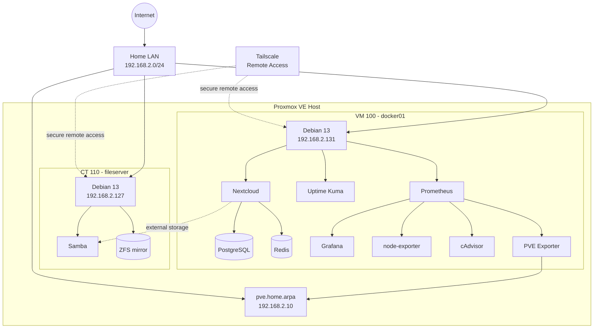

# HomeLab

Personal homelab used to build and operate a small self-hosted infrastructure environment with **Proxmox VE, Debian, Docker Compose, ZFS, Samba, Tailscale, Nextcloud, Prometheus, Grafana, and Uptime Kuma**.

The goal of this repository is to keep the service configuration and infrastructure documentation reproducible while keeping credentials, application data, backups, and other sensitive runtime state out of Git.

> **Status:** Active and in use. Core storage, remote access, backups, private cloud, uptime monitoring, and metrics monitoring are operational. Reverse-proxy/public-service work and CI/CD are planned next.

## Current Environment

| Layer | Current implementation | Status |
| --- | --- | --- |
| Hypervisor | Proxmox VE | ✅ Operational |
| File storage | Debian container + Samba on a mirrored ZFS pool | ✅ Operational |
| Remote access | Tailscale | ✅ Operational |
| Container host | Debian VM running Docker Compose | ✅ Operational |
| Private cloud | Nextcloud + PostgreSQL + Redis | ✅ Operational |
| Availability monitoring | Uptime Kuma | ✅ Operational |
| Metrics | Prometheus | ✅ Operational |
| Dashboards | Grafana | ✅ Operational |
| Host metrics | node-exporter | ✅ Operational |
| Container metrics | cAdvisor | ✅ Operational |
| Proxmox metrics | prometheus-pve-exporter | ✅ Operational |
| Backups / snapshots | Proxmox backups + ZFS snapshot workflow | ✅ Operational |
| Reverse proxy / tunnel | Nginx + Cloudflare Tunnel | 🛠 Planned |
| Portfolio hosting | Self-hosted deployment | 🛠 Planned |
| CI/CD | Automated validation/deployment workflows | 🛠 Planned |

## Logical Architecture



See [`docs/architecture.md`](docs/architecture.md) for the topology and service-flow documentation.

## Repository Structure

```text
.
├── README.md
├── docs/
│   ├── architecture.md
│   ├── security.md
│   └── setup.md
└── stacks/
    ├── exporters/
    │   └── docker01/
    │       └── compose.yaml
    ├── monitoring/
    │   ├── compose.yaml
    │   ├── pve.yml.example
    │   ├── grafana/
    │   │   └── provisioning/
    │   ├── prometheus/
    │   │   └── prometheus.yml
    │   └── secrets/              # ignored except .gitkeep
    ├── nextcloud/
    │   ├── compose.yaml
    │   └── Dockerfile
    └── uptime-kuma/
        └── compose.yaml
```

## Service Design

### Nextcloud

Nextcloud runs as a multi-container stack with:

- a custom `nextcloud:34-apache` image with SMB client support;
- PostgreSQL 17 for the application database;
- Redis for caching/locking;
- a separate Nextcloud cron container;
- Docker secrets for database and initial administrator credentials;
- persistent named volumes for the database and Nextcloud application data.

PostgreSQL and Redis are **not published to the host network**. Only the Nextcloud web application is published.

### Monitoring

The monitoring stack includes:

- **Prometheus** for time-series metrics;
- **Grafana** with a provisioned Prometheus data source;
- **node-exporter** for Linux host metrics;
- **cAdvisor** for Docker/container metrics;
- **prometheus-pve-exporter** for Proxmox VE metrics.

Exporter exposure is intentionally limited:

- PVE exporter has **no host-published port** and is reached by Prometheus over the Compose network.
- node-exporter listens only on the Docker host's LAN address rather than all host interfaces.
- cAdvisor is published only on the Docker host's LAN address rather than `0.0.0.0`.

More detail is in [`docs/security.md`](docs/security.md).

### Uptime Kuma

Uptime Kuma provides service availability monitoring and stores runtime data outside the Git repository under `/srv/docker/appdata/uptime-kuma`.

## Storage and Backups

The main file server uses a mirrored ZFS pool for storage redundancy and exposes shared storage using Samba. Snapshots/backups are treated separately from disk redundancy; the environment also uses Proxmox-level guest backups and ZFS snapshot workflows.

Runtime application data, backups, private keys, `.env` files, and secret directories are excluded from source control.

## Secrets and Local Configuration

**No production credentials belong in this repository.** Required secrets are created locally on the host and are ignored by Git.

The current stacks require:

### Nextcloud

```text
stacks/nextcloud/secrets/postgres_db
stacks/nextcloud/secrets/postgres_user
stacks/nextcloud/secrets/postgres_password
stacks/nextcloud/secrets/nextcloud_admin_user
stacks/nextcloud/secrets/nextcloud_admin_password
```

### Monitoring

```text
stacks/monitoring/secrets/grafana_admin_password
stacks/monitoring/secrets/pve.yml
```

A safe example PVE exporter configuration is provided as [`stacks/monitoring/pve.yml.example`](stacks/monitoring/pve.yml.example).

See [`docs/setup.md`](docs/setup.md) for the complete setup procedure.

## Network Exposure

This homelab is designed for a trusted private network. Services are **not intended to be directly exposed to the public Internet** by simple router port-forwarding.

Current published application ports include:

| Service | Host port | Intended scope |
| --- | ---: | --- |
| Grafana | 3000 | Trusted LAN / administrative access |
| Uptime Kuma | 3001 | Trusted LAN / administrative access |
| Prometheus | 9090 | Trusted LAN / administrative access |
| Nextcloud | 8081 | Trusted LAN; future reverse-proxy path |
| node-exporter | 9100 | Docker host LAN interface only |
| cAdvisor | 8080 | Docker host LAN interface only |
| PVE exporter | none | Internal Compose network only |

Future public-facing services will be placed behind a reverse proxy/tunnel rather than exposing backend service ports directly.

## Deployment

Each stack is managed independently with Docker Compose. For example:

```bash
cd stacks/monitoring
docker compose pull
docker compose up -d
```

Nextcloud uses a locally built image:

```bash
cd stacks/nextcloud
docker compose build
docker compose up -d
```

See [`docs/setup.md`](docs/setup.md) before deploying because the secret files must exist first.

## Roadmap

Current next steps:

1. Add Nginx/reverse-proxy configuration and Cloudflare Tunnel where appropriate.
2. Host the portfolio site from the homelab.
3. Add automated Compose/YAML validation through GitHub Actions.
4. Continue improving backup verification and restore documentation.
5. Expand monitoring dashboards and alerting.
6. Explore CI/CD and, later, Kubernetes as learning projects where they provide practical value.

## Security Notes

This repository intentionally contains private RFC1918 addressing and hostnames because they are useful for documenting the architecture; they are not authentication secrets. Credentials, API token values, private keys, certificates, and application data must never be committed.

Before making a previously private repository public, the **entire Git history** should also be scanned for accidentally committed secrets—not only the current working tree.

For additional details, see [`docs/security.md`](docs/security.md).
