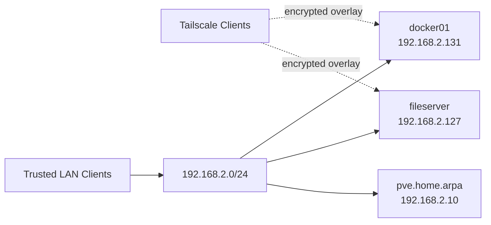
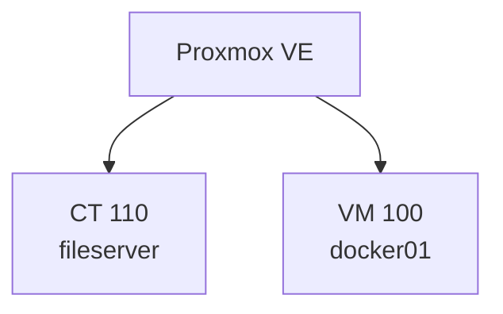
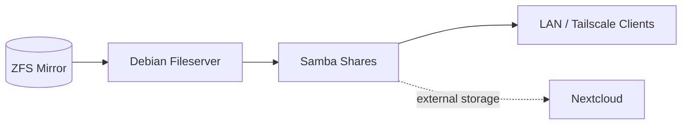
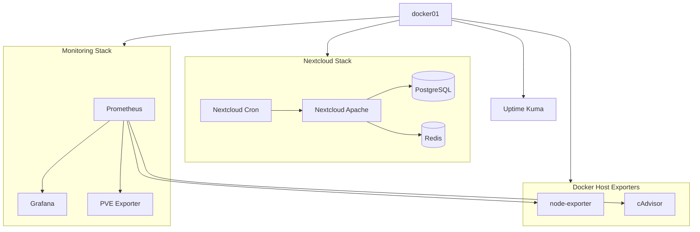
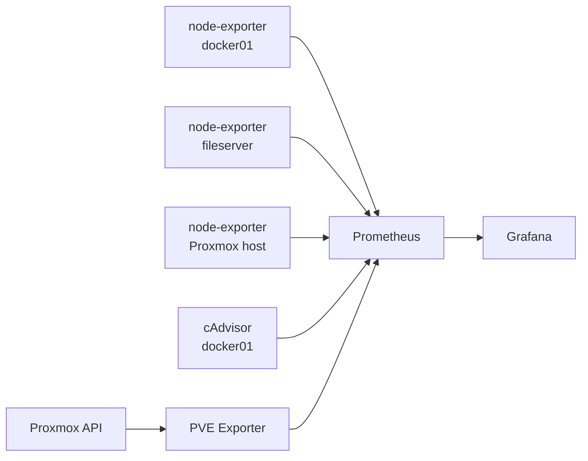
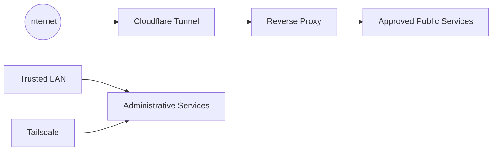

# Architecture and Topology

This document describes the logical homelab architecture represented by this repository. The repository focuses on compute, storage, container services, and monitoring rather than documenting every physical switch or endpoint on the home network.

## Design Goals

The environment is built around a few practical goals:

- centralize compute on a Proxmox VE host;
- separate file-serving duties from application/container workloads;
- keep important data on redundant ZFS storage;
- use Docker Compose for reproducible self-hosted services;
- provide private remote access through Tailscale;
- collect host, container, and hypervisor metrics in one monitoring stack;
- avoid committing credentials or runtime application state to Git;
- gradually move public-facing workloads behind a controlled reverse-proxy/tunnel layer.

## Logical Network

The primary server-side network is currently on the `192.168.2.0/24` private LAN.

| Host | Role | Address |
| --- | --- | --- |
| `pve.home.arpa` | Proxmox VE hypervisor | `192.168.2.10` |
| `fileserver` | Debian file server container | `192.168.2.127` |
| `docker01` | Debian Docker VM | `192.168.2.131` |

These private addresses are included for topology clarity. They are RFC1918 addresses and are not routable from the public Internet.

## Proxmox Layer

The Proxmox host provides the virtualization layer for the environment.

The separation is intentional:

- the **file server** owns Samba/storage responsibilities;
- the **Docker VM** owns application containers and monitoring services;
- the **Proxmox host** remains focused on virtualization rather than becoming a general-purpose application server.

## Storage Layer

The file server uses a mirrored ZFS pool for primary shared storage.

The mirrored pool provides disk redundancy, while snapshots and backups are maintained separately. Mirroring is therefore not treated as a substitute for backups.

## Docker Host

The Docker VM runs independent Compose stacks rather than one large Compose project. This keeps service lifecycle and troubleshooting boundaries simple.

## Monitoring Data Flow

Prometheus is the collection point for metrics from the Docker host, file server, and Proxmox environment.

The PVE exporter is kept inside the monitoring Compose network and is not published as a host-accessible service. Prometheus forwards the target Proxmox node to the exporter using relabeling.

## Service Boundaries

Several services intentionally remain reachable only through internal Docker networks:

- Nextcloud PostgreSQL database;
- Nextcloud Redis service;
- PVE exporter after the current hardening change.

User-facing or administrator-facing services may publish host ports, but the current design assumes they are used from a trusted LAN or a controlled remote-access path.

## Planned Evolution

The next architecture phase is expected to add a controlled ingress layer:

The goal is to keep administrative interfaces such as Prometheus and infrastructure exporters off direct public ingress while selectively publishing services that actually require Internet access.
